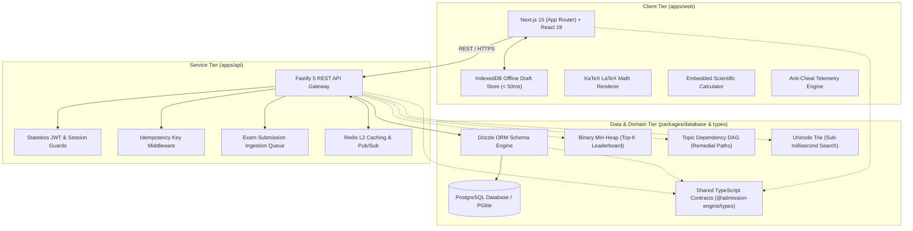

# 🎓 Admission Exam Engine — High-Concurrency EdTech Platform

[](https://www.typescriptlang.org/)
[](https://nextjs.org/)
[](https://react.dev/)
[](https://fastify.dev/)
[](https://www.postgresql.org/)
[](https://orm.drizzle.team/)
[](https://redis.io/)

A distributed, low-latency online admission examination engine and adaptive learning platform designed for high-stakes, large-scale competitive entrance exams (e.g., BUET, Medical / MBBS, DU, and STEM University Clusters).

Built as an end-to-end type-safe monorepo, the platform delivers zero-data-loss test environments, real-time proctoring telemetry, in-exam STEM equation rendering, and custom in-memory data structures (Heaps, DAGs, and Tries) for high-efficiency ranking and diagnostic learning paths.

---

## 🏛️ System Architecture

The project is structured as an enterprise-grade monorepo powered by `pnpm` workspaces, isolating client-side interfaces, core services, database persistence, and domain contracts into distinct boundaries:



### Monorepo Structure

| Package | Role | Key Technologies |
| :--- | :--- | :--- |
| **`apps/web`** | Student Examination Portal & Administrative Command Center | Next.js 15, React 19, Tailwind CSS, TanStack Query, Framer Motion, IndexedDB |
| **`apps/api`** | High-throughput delivery API, exam validation & submission gateway | Fastify 5, Zod, Redis Pub/Sub & Caching, Idempotency Layer |
| **`packages/database`** | Database schema, Drizzle ORM client, seed pipelines & custom DSA | PostgreSQL, Drizzle ORM, `@electric-sql/pglite`, Migration Scripts |
| **`packages/types`** | Shared domain entities, DTOs, API payloads, and strict contract definitions | Pure TypeScript (Zero-runtime overhead) |

---

## 💻 Technology Stack

### Frontend & Client Applications
* **Next.js 15 (App Router) & React 19:** Server and client components utilized strategically for optimal initial payload size, lightning-fast rehydration, and dynamic routing.
* **TypeScript (Strict Mode):** 100% type-safe codebase sharing interfaces with backend services to prevent runtime contract mismatches.
* **Tailwind CSS & Framer Motion:** Accessible, responsive UI optimized for low-latency interactions, smooth state transitions, and responsive exam layouts.
* **TanStack React Query v5:** Declarative server-state synchronization with intelligent background re-fetching and optimistic cache updates.
* **IndexedDB (`idb`):** Local browser database persistence enabling uninterrupted exam taking and instant offline recovery.
* **KaTeX:** High-performance mathematical typesetting for rendering complex Physics, Chemistry, and Higher Mathematics LaTeX equations on the fly.

### Backend Services & API
* **Fastify 5:** High-throughput, low-overhead Node.js web framework selected for its minimal abstraction overhead and high request handling capacity under high concurrent load.
* **Zod:** Runtime schema validation ensuring strict validation of exam answers, auth payloads, and ingestion streams.
* **Redis Pub/Sub & Caching:** Real-time analytics event dispatching, session management, and candidate cache layers.
* **Idempotency Safeguards:** Custom header-based idempotency handling (`x-idempotency-key`) ensuring duplicate network requests during exam submission never double-evaluate or corrupt candidate scores.

### Database & Persistence
* **PostgreSQL:** Production-grade relational database modeling multi-tenancy, complex hierarchical taxonomies, and high-concurrency exam submissions.
* **Drizzle ORM:** Ultra-lightweight, SQL-like TypeScript ORM offering compile-time query safety without the memory footprint or overhead of heavy traditional ORMs.
* **PGlite (`@electric-sql/pglite`):** WASM-based embedded Postgres environment allowing rapid localized testing, migrations, and zero-configuration CI environments.

---

## 🚀 Core MVP Engineering Features

### 1. Offline-Resilient Exam Hall (Zero Data Loss)
* **Sub-50ms IndexedDB Draft Caching:** Every choice selected by the candidate is immediately persisted to local browser IndexedDB storage.
* **Network Drop & Refresh Immunity:** If a candidate accidentally closes their browser or experiences a connectivity failure, all answers and active test state are automatically rehydrated instantly upon reopening.
* **Tamper-Proof Synchronized Clock:** Exam time remaining is computed against an authenticated server timestamp offset, preventing client-side system clock manipulation or local time tampering.

### 2. Automated Anti-Cheat & Proctoring Engine
* **Real-time Infraction Tracking:** Listens to the browser's `Page Visibility API`, `window.blur`, full-screen exit events, and dev tools inspection attempts.
* **Progressive Discipline Protocol:** Displays escalating warnings on detected tab switches and automatically logs infractions directly to the backend `cheating_logs` repository for administrative review.
* **Full-screen Lockdown Mode:** Enforces an immersive, distraction-free environment tailored for university admission standards.

### 3. Purpose-Built In-Memory Data Structures & Algorithms (DSA)
To solve real performance bottlenecks encountered during high-scale testing, custom algorithmic structures were designed and implemented directly in TypeScript:
* **Top-K Leaderboard Min-Heap (`leaderboard-heap.ts`):** 
  * Replaces expensive $O(N \log N)$ database sort queries with an $O(N \log K)$ binary min-heap.
  * For 50,000+ candidates, computing the Top-100 ranks operates in $O(K)$ space with sub-millisecond speed.
  * Implements multi-tier admission tie-breaking: **Score (Desc) $\rightarrow$ Wrong Count (Asc) $\rightarrow$ Completion Speed (Asc)**.
* **Topic Dependency DAG (`topic-dag.ts`):**
  * Models syllabus hierarchies (e.g., *Vectors $\rightarrow$ Dynamics $\rightarrow$ Circular Motion*) as a Directed Acyclic Graph.
  * Analyzes student weaknesses and computes a topologically sorted remedial roadmap to help candidates master prerequisite concepts first.
* **In-Memory Unicode Trie (`trie-search.ts`):**
  * High-performance prefix-search structure tailored for dual-script search (Bengali Unicode and English terms).
  * Powers sub-millisecond instant autocomplete across question banks, topics, and university tags in $O(L)$ time complexity.

### 4. Interactive STEM Exam Toolkit
* **Dynamic LaTeX Equation Engine:** Native integration with KaTeX renders formula-heavy questions (calculus integrals, chemical reactions, thermodynamic equations) with zero layout shifts.
* **Floating Scientific Calculator:** In-exam floating calculator supporting trigonometric, logarithmic, power, and algebraic functions matching physical admission calculator specifications (FX-series standard).

### 5. Smart "Mistake Book" & Diagnostic Analytics
* **Automated Error Logging:** Incorrect and unattempted answers are classified and routed to the candidate's personal Mistake Book.
* **Spaced Revision:** Detailed explanation breakdowns, syllabus chapter references, and target topic accuracy tracking help candidates identify high-yield areas for improvement.

### 6. Admin Command Center & Ingestion Pipeline
* **Batch Ingestion Jobs:** Automated background pipelines validate, normalize, and bulk-insert question datasets into the production taxonomy.
* **Taxonomy & Unit Management:** Centralized management of universities (BUET, DU, Medical, GST), faculty units, subjects, and chapter breakdowns.

---

## 🗄️ Database Domain Model

The schema is built around multi-tenancy, auditability, and data integrity:

```
[Tenants] ──< [Users] ──< [Submissions] >── [Exams] ──< [Questions]
                │               │                          │
                ├──< [Mistake Book]                        ├──< [Taxonomy]
                ├──< [User Analytics]                      └──< [Question Drafts]
                └──< [Cheating Logs]
```

* **`tenants`**: Multi-tenant isolation for educational institutions and coaching centers.
* **`users`**: Role-based access control (Student, Teacher, Tenant Admin, Super Admin).
* **`taxonomy`**: Recursive subject/chapter/topic hierarchy linked to syllabus specifications.
* **`questions`**: Rich question storage supporting LaTeX formulas, multiple options, explanations, and difficulty ratings.
* **`exams`**: Test rules, negative marking policies (e.g., 0.25 penalty), duration, and scheduled availability windows.
* **`submissions`**: Evaluated candidate answer sheets, time-per-question telemetry, and final scores.
* **`cheating_logs`**: Proctoring audit trail with infraction timestamps, event types, and candidate IDs.
* **`mistake_book`**: Automated repository for candidate error tracking and revision workflows.
* **`user_analytics` & `user_topic_metrics`**: Aggregated performance metrics by subject and topic.

---

## 🛡️ Reliability, Security & Design Decisions

* **End-to-End Type Safety:** Types and Zod schemas shared across the frontend and API layers eliminate serialization drift and guarantee contract compliance.
* **Idempotent Exam Finalization:** Submissions carry unique idempotency tokens, preventing race conditions, accidental double-clicks, or retry collisions from altering score outcomes.
* **Zero Client Secret Exposure:** Client builds only interface through stateless authenticated sessions; administrative endpoints are strictly protected by role-based guards.
* **Database Agility:** Drizzle ORM abstracts SQL execution while maintaining raw SQL efficiency, verified locally with embedded PGlite for zero-latency integration tests.